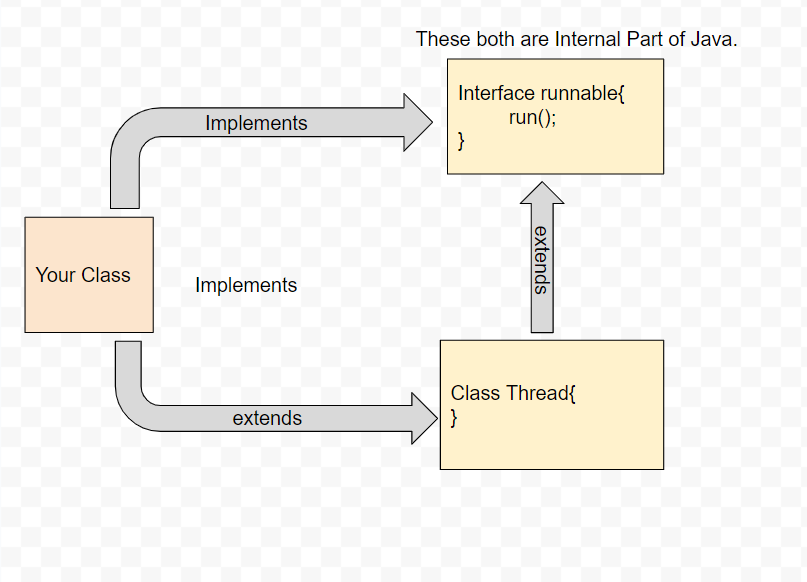

<h3><u><i>Evolution of Concurrency in Java</i></u></h3>

1. First Java Introduced concepts of Thread in the earliest version of Java around 1.0

      
    Thread can be created using two ways
    - By extending Thread class
```Java
class MyThread implements Runnable{
	public void run(){
	// Task
    }
}
MyThread nyThread = new MyThread();
Thread t = new Thread(myThread);
t.start();
```
    - By implementing Runnable Interface
```Java
class MyThread extends Thread{
	public void run(){}
}
MyThread t = new MyThread();
t.start();
```


2. The Executor Framework - introduced in Java 5.
    
    
    It introduced ThreadPoolExecutor, ExecutorService and provided higher level of abstraction using these.
    Now, developer need not to care of managing multiple threads, they can create a pool of x number of threads, and executor
    responsible for task execution by taking any availble thread from that pool.
    
```Java
import java.util.concurrent.ExecutorService;
import java.util.concurrent.Executors;

class MyRunnable implements Runnable {
    public void run() {
        System.out.println("This is a new thread.");
    }
}

public class Main {
    public static void main(String[] args) {
        ExecutorService executor = Executors.newFixedThreadPool(4);
        executor.submit(new MyRunnable());
        executor.shutdown();
    }
}
```

3. The Fork/Join Framework - introduced in Java 7.
4. Completable Future - Introduced in Java 8.