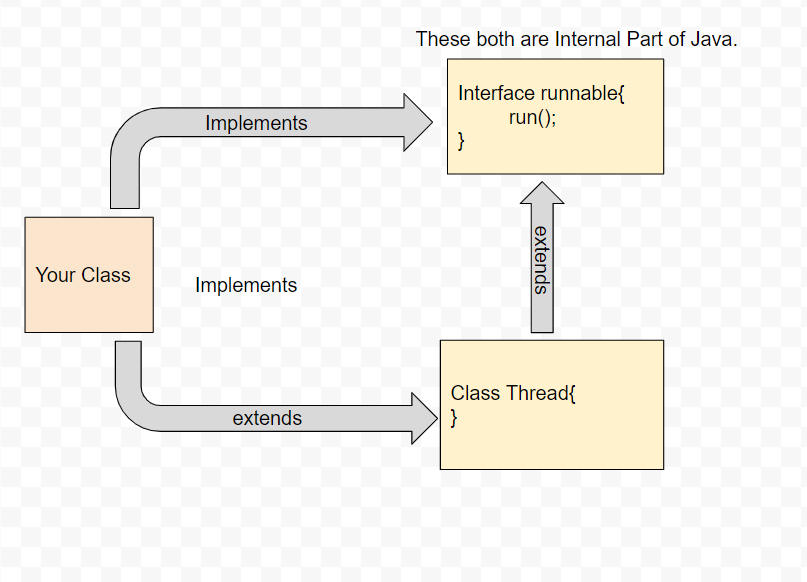

<h3><u><i>Evolution of Concurrency in Java</i></u></h3>

1. **_First Java Introduced concepts of Thread in the earliest version of Java around 1.0_**

      
    Thread can be created using two ways
    - By extending Thread class
```Java
class MyThread implements Runnable{
	public void run(){
	// Task
    }
}
MyThread nyThread = new MyThread();
Thread t = new Thread(myThread);
t.start();
```
    - By implementing Runnable Interface
```Java
class MyThread extends Thread{
	public void run(){}
}
MyThread t = new MyThread();
t.start();
```

#### Note

- JVM stack is private to its Thread, and each method call is stored in that private stack.
- Stack makes entry in form of `Frames`. Frame is kind of wrapper to store local variables, local operand stacks, reference, dispatch actions.
- Each thread has its own stack, and one thread can not access stack of another thread.
[Read here More on MultiThreading in Java](https://medium.com/java-interview-revision-question-bank/everything-about-java-multithreading-be234f5ac119)



2. **_The Executor Framework - introduced in Java 5._**
    
    
    It introduced ThreadPoolExecutor, ExecutorService and provided higher level of abstraction using these.
    Now, developer need not to care of managing multiple threads, they can create a pool of x number of threads, and executor
    responsible for task execution by taking any availble thread from that pool.
    
```Java
import java.util.concurrent.ExecutorService;
import java.util.concurrent.Executors;

class MyRunnable implements Runnable {
    public void run() {
        System.out.println("This is a new thread.");
    }
}

public class Main {
    public static void main(String[] args) {
        ExecutorService executor = Executors.newFixedThreadPool(4);
        executor.submit(new MyRunnable());
        executor.shutdown();
    }
}
```
The main use I always seem to find for using a thread-pool is that is very nicely manages a very common problem: 
producer-consumer. In this pattern, someone needs to constantly send work items (the producer) to be processed by someone 
else (the consumers). The work items are obtained from some stream-like source, like a socket, a database, or a collection 
of disk files, and needs multiple workers in order to be processed efficiently. The main components identifiable here are:
`the producer: a thread that keeps posting jobs
a queue where the jobs are posted
the consumers: worker threads that take jobs from the queue and execute them`
In addition to this, synchronization needs to be employed to make all this work correctly, since reading and writing to the 
queue without synchronization can lead to corrupted and inconsistent data. Also, we need to make the system efficient, since 
the consumers should not waste CPU cycles when there is nothing to do.
Now this pattern is very common, but to implement it from scratch it takes a considerable effort, which is error-prone and 
needs to be carefully reviewed.
The solution is the thread pool (Uses ArrayBlocking Queue). It very conveniently manages the work queue, the consumer threads 
and all the synchronization needed. All you need to do is play the role of the producer and feed the pool with tasks!

(Reference of above paragraph from <a href="https://stackoverflow.com/questions/9717901/poc-proof-of-concept-of-threadpools-with-executors">Stackoverflow</a>)

3. _**The Fork/Join Framework - introduced in Java 7.**_
- Fork/Join framework, based on `divide and conquer approach`, divides a large task using fork() operation, and then combine
    the result of pending task using join() operation.
- It enables degree of Parallelism by using `Divide and Conquer` and `Work Stealing` mechanisms.
- Fork/Join Framework's heart is `ForkJoinPool` which uses Work Stealing mechanism. this pool has some worker threads, and a task
    queue (tasks are submitted here). Every worker thread has work-stealing queue (Deque).
    
  ##### There are few things to be noted
  1. ForkJoinPool itself does not divide the tasks or merge them, it is decided by programmers.
  2. Programmers decide whether a task is needed to be divided or not.
  
  #### Parallel Algorithm with ForkJoinPool
  1. Create `RecursiveTask`  (Just like in ExecutorService, Runnable/Callable task)
  2. Submit above task to `ForkJoinPool`  (Submitting task to ExecutorService)
  
  #### Key Points
  1. ForkJoinPool is one implementation of `ExecutorService`.
  2. Task submitted to `ForkJoinPool` is `ForkJoinTask` or `RecursiveTask`.
  3. In `ThreadPoolExecutor (ExecutorService)`, we submit multiple tasks, but in `ForkJoinPool` a large task is submitted, and rest
    is taken care by framework.
  4. ForkJoinTask has two main implementations: `RecursiveAction` and `RecursiveTask`.
  5. RecursiveAction is just like `Runnable` which does not return any value.
  6. RecursiveTask is just like `Callable` which return any value.
  
  #### ForJoinPool Internals
  1. `ForkJoinPool` gets task from Non-ForJoinPool Client (Basically main thread) by calling `execute()`, `invoke()`, or `submit()`
  2. `ForkJoinPool` maintains a `GlobalQueue` shared among all worker threads internally.
  3. Each WorkerThread has its own Local queue, `WorkerQueue`/`WorkStealing Queue`, So that Maximum CPU Utilization can be done.
  4. Now, Worker Thread picks task from three different Queues (Not only local queue)
     1. GlobalQueue or SharedQueue
     2. Local Work-Stealing Queue
     3. Other Thread's Work-Stealing Queue
  5. 
- Check Out the Tutorial [here](https://medium.com/@cs.vivekgupta/overview-of-fork-join-framework-core-of-parallelism-in-java-35f4a4cc8c3b).

4. **_Completable Future - Introduced in Java 8._**

CompletableFuture is Java 8’s answer to this problem: **`Future` gives you a value “later”, but it’s hard to compose**.
With `Future`, you often end up blocking (`get()`), manually wiring callbacks, or managing threads yourself.

**Official references (recommended reading)**
- CompletableFuture Javadoc (Java 8): https://docs.oracle.com/javase/8/docs/api/java/util/concurrent/CompletableFuture.html
- CompletionStage Javadoc (Java 8): https://docs.oracle.com/javase/8/docs/api/java/util/concurrent/CompletionStage.html
- Concurrency utilities changes in Java 8: https://docs.oracle.com/javase/8/docs/technotes/guides/concurrency/changes8.html

#### What it is
- `CompletableFuture<T>` implements **both**:
  - `Future<T>` (represents a result that will be available later)
  - `CompletionStage<T>` (lets you **attach stages** that run when the result is ready)
- It can be **completed explicitly** using `complete(value)` or `completeExceptionally(ex)`. (See Javadoc)

#### What problem it solves (in simple terms)
- **No blocking by default**: instead of calling `get()`, you attach “what to do next”.
- **Composition**: chain async steps (`thenCompose`), combine results (`thenCombine`), and wait for many (`allOf/anyOf`).
- **Clear exception handling**: handle failures as part of the pipeline (`exceptionally`, `handle`, `whenComplete`).

#### Basic mental model (pipeline)
Think of it like a pipeline:
1) start an async computation
2) transform result
3) combine with other async work
4) handle errors
5) end with a final action

```java
import java.util.concurrent.CompletableFuture;

CompletableFuture.supplyAsync(() -> "hello")     // start async
        .thenApply(s -> s.toUpperCase())         // transform
        .thenAccept(System.out::println)         // consume
        .exceptionally(ex -> {                   // handle error
            ex.printStackTrace();
            return null;
        });
```

#### Key APIs you’ll use in real code
- **Transform**
  - `thenApply(fn)` → change the result
  - `thenAccept(consumer)` → consume result, return void stage
  - `thenRun(runnable)` → run action, ignores result

- **Async variants**
  - `thenApplyAsync(...)`, `thenAcceptAsync(...)`, etc.
  - If you don’t pass an `Executor`, async stages use `ForkJoinPool.commonPool()` by default (see CompletableFuture Javadoc).

- **Compose vs Combine (most common interview topic)**
  - `thenCompose(fnReturningStage)` → **flatten** nested futures (do step-2 after step-1)
  - `thenCombine(otherStage, combiner)` → **join** two independent stages and combine results

- **Many futures**
  - `CompletableFuture.allOf(f1, f2, ...)` → completes when all complete (result type is `Void`)
  - `CompletableFuture.anyOf(f1, f2, ...)` → completes when any completes

- **Exception handling**
  - `exceptionally(fn)` → recover from failure (only runs on exception)
  - `handle((value, ex) -> ...)` → runs on success or failure, can transform to a new value
  - `whenComplete((value, ex) -> ...)` → “peek” for logging/side effects; keeps same result/exception

#### Common pitfalls (important)
- **Don’t call `get()` too early**: that turns async code back into blocking code.
- **Be aware of thread pool usage**: async stages default to `ForkJoinPool.commonPool()` unless you supply an `Executor`.
- **Exceptions are wrapped**: failures in stages often appear wrapped in `CompletionException` (see CompletionStage Javadoc).
- **Cancellation doesn’t stop your work automatically**: cancelling a CompletableFuture marks it exceptionally completed, but it may not interrupt the underlying work (see CompletableFuture Javadoc).
- **Difference between `Future` and `CompletableFuture`**
  - `Future`: represents a value “later”, but isn’t naturally composable; you often block with `get()`.
  - `CompletableFuture`: a `Future` + `CompletionStage` pipeline; you attach stages (`thenApply/...`) and compose async work without blocking.

- **When to use `thenCompose()` vs `thenCombine()`**
  - `thenCompose`: when the next step returns another `CompletableFuture` (dependent async call). It “flattens” nested futures.
  - `thenCombine`: when you have two independent futures and want to combine results after both complete.

- **Default executor used by `*Async()` methods (no executor provided)**
  - `ForkJoinPool.commonPool()` (as per Java 8 `CompletableFuture` Javadoc).

- **Difference between `exceptionally()`, `handle()`, and `whenComplete()`**
  - `exceptionally(fn)`: runs only on failure; returns a recovery value.
  - `handle((value, ex) -> ...)`: runs on success or failure; returns a value (transform or recover).
  - `whenComplete((value, ex) -> ...)`: runs on success or failure for side effects (logging/metrics); keeps the same result/exception unless you throw.

- **Why `get()` inside a pipeline is bad**
  - It blocks threads (kills async benefits), can cause thread starvation/deadlocks on limited pools, and usually belongs only at the very end (or not at all).